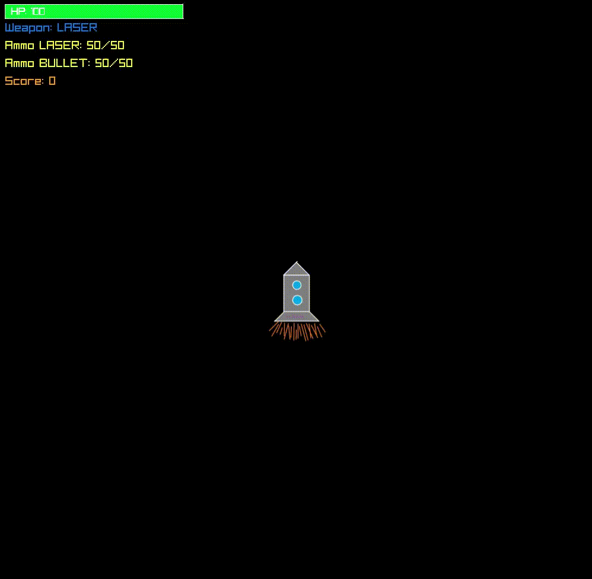

# Asteroid_PG_Lab
>Simple asteroid game using C++ /n
>This reposytory is a part of lab assigment at **Gdańsk University of Technology** /n
>Skeleton of this game is made by: /n
>**M.E. Kajetan Kruczkowski** from **Gdańsk University of Technology** 

Added features:
1. Health Bar
2. Ammunation system
3. "Game Over" screen
4. Score counter
5. Asteroids now shrink after being hit
5. More "friendly" spaceship

